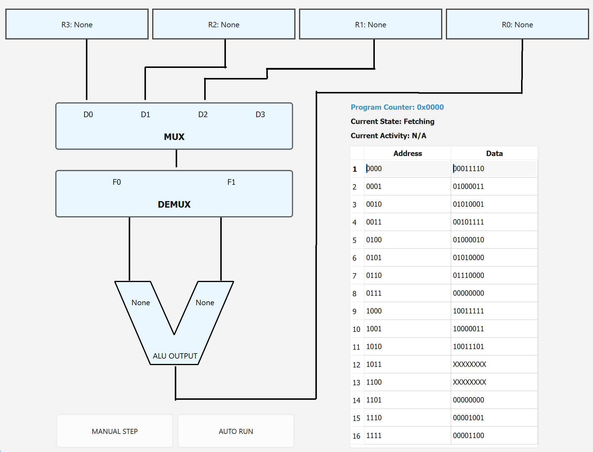

# 18-100 von Neumann Computer Architecture Simulator

## Motivation
Von Neumann computer architecture is the foundation of most modern general-purpose computing. This is taught in 18-100 Introduction to ECE through a highly abstracted computer architecture model. As both a past-18100 student and current TA, the problem is that tracing through each step can tedious and error-prone as the steps are very intricate. So, I wanted to make a simulator as an educational tool for helping students understand the basics of computer architecture and how it would work with stronger visualization.



## Code Organization
My goals were:
- focusing on modularity
- code clarity
since I knew there would be a lot of interfacing between different components, it would get really complicated if I didn't organize things from top-down design.

von Neumann architecture gives itself nicely to object-oriented programming, so my code is organized like so:
- alu.py: all functions related to alu
- cpu.py: includes fetch, decode, execute functions for cycling
- decoder.py: contains code mapping instructions to executable states
- demux.py: stores data from currently selected data line
- mux.py: stores data from linked register
- ram.py: stores instructions + data
- register.py: defines register class, including program counter and instruction register as children
- utils.py: conversion & formatting functions

The above defines and operates my entire model.

Then, I have a UI folder with
- alu_symbol.py: draws alu
- background.py: draws wire background
- main_window.py: functions that handle all drawing
- register_display.py: handles making the actual register views

Finally, to make better organization, I only have a main.py file where you actually run the code that sets up the parameters and runs the simulator.

## Basics of von Neumann Architecture
The components of von Neumann architecture are:
- RAM (random access memory: long-term storage for operating instructions and data
- registers: short-term storage for data used in executing operations
- instruction register: register that's only purpose is storing the current active instruction
- decoder: interpreting what is the next step
- mux: selects between multiple input lines (in this case, the registers)
- demux: 'routes' the data from the mux to the specified output (in this case, the arithmetic logic unit).
- arithmetic logic unit: the unit that we can specify to perform adding/subtracting/detecting 0, etc.
- program counter: keeps track of the current address we are reading from

## Moving Through the Computer

### Interpreting Instructions
Each data corresponding to an address is actually an instruction that tells the CPU what to do next in a specific format. For example, the instruction at address 1 is: 00011110. Each instruction is broken into two 4-bit sections. The first four bits are the op-code, which tell the decoder what to do. The last four bits are the operand, which tell the decoder what address in the RAM to read/write form. In this example:
- 0001 = 1 -> select R1 and write the data from the given address to it
- 1110 = 13 -> address of data in RAM
So taken together 0001 and 1110 mean: 'write the data from the 13th line in RAM into R1'

### Decoding Instructions
The decoder can take inputs from 0-9. In my program, here is the key in the Decoder class:
```
self.decoder = {
            0 : 'Writing to Register 0',
            1 : 'Writing to Register 1',
            2 : 'Writing to Register 2',
            3 : 'Writing to Register 3',
            4 : 'Storing to Multiplexer',
            5 : 'Storing to De-multiplexer',
            6 : 'Adding numbers in ALU',
            7 : 'Subtracting numbers in ALU',
            8 : 'Testing if result is negative',
            9 : 'Writing result to RAM',
        }
  ```
### Executing Instructions
Based on what the instruction is from the decoder, the CPU will then execute the instruction. All of this happens in the model in the execute() function.

### State Management
To keep track of what state my CPU is in, I implement a simple state machine to allow the user to know what cycle of instruction fetching/decoding/executing the process is currently in:
```
def manual_step(self):
        state = self.get_state()
        if state == 'Fetching':
            try:
                fetch(self.pc, self.ir, self.ram)
            except ValueError:
                self.step_btn.setEnabled(False)
                self.auto_btn.setEnabled(False)
                self.state_counter = -1
                self.timer.stop()
                return
        elif state == 'Decoding':
            self.ir_data = self.ir.read_from_ir()
            op = self.ir.opcode
            self.dc_output = decode(self.dc.get_decoder(), op)
        elif state == 'Executing':
            execute(self.dc_output, self.ir_data, self.gpr, self.ram, self.mx, self.dx, self.ir, self.alu, self.pc)
```


